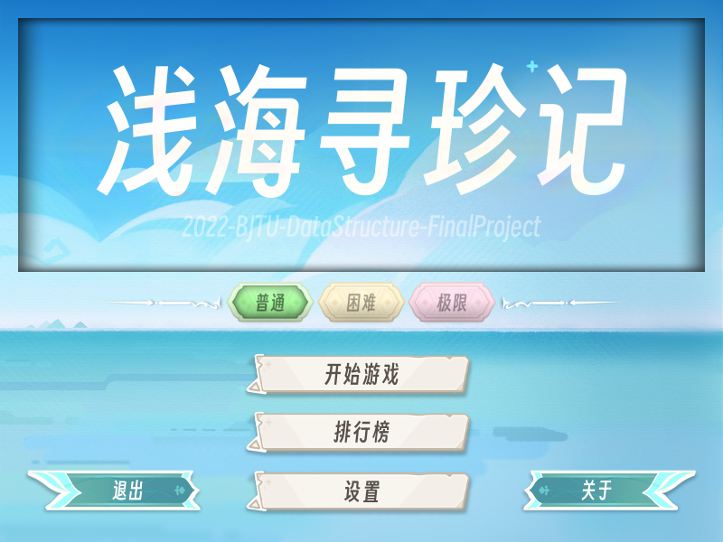
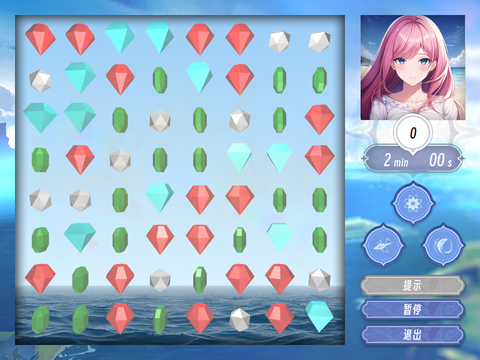
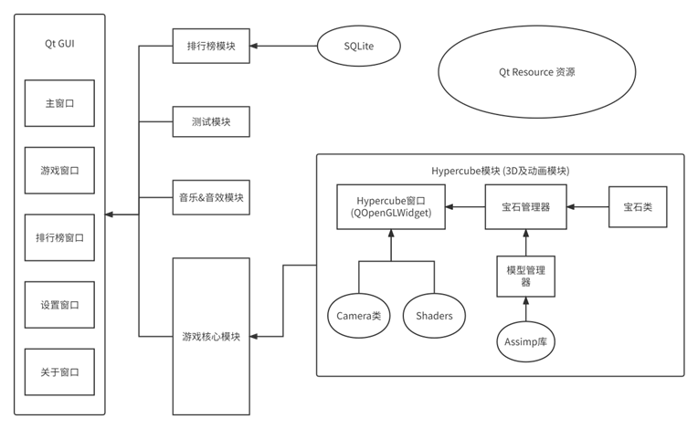

# 浅海寻珍记
> 2022 北京交通大学 软件学院 实训大作业



***

### 1. 简介

* “浅海寻珍记”是一款以“海与宝藏”为主题的三消类休闲游戏，玩家在规定时间内通过对调选中宝石的位置，构成同直线上至少三颗相同颜色的宝石，并以此消除得分。

* 游戏设置有“普通”“困难”“极限”三个难度供玩家选择，难度越高，屏幕内同时出现的宝石种类越多。游戏以消除更多宝石并冲击高分为目的，每轮游戏结束后，玩家可选择记录下自己的分数和昵称，并随时查看得分排行。

* 游戏设置有三种技能以辅助玩家消除宝石，技能使用后将进入冷却状态，一次性消除至少5块成串的宝石，可以增加一次技能使用次数。技能分别如下：
  * 漩涡：以所选中的宝石为中心，消除半径为2格范围内的所有宝石；
  * 导电：清除屏幕范围内所有和选中颜色相同的宝石；
  * 潮涌：清除屏幕范围内的所有宝石。



***

### 2. 功能

* 漂亮的UI 与 **3D画面**
  * [Hypercube 3D及动画模块文档](./code/hypercube/README.md)
* 三种技能、提示功能、暂停功能
* 普通、困难、极限这三种不同难度
* 排行榜页面、关于页面、设置页面
* 可以在Github仓库的 [Release页面](https://github.com/YXHXianYu/2022-BJTU-DataStructure-FinalProject/releases) 下载 **可执行程序包** (Windows)

***

### 3. 系统架构



***

### 4. 编译

#### 4.1 编译环境

* 编译器: Desktop Qt 5.9.9 MinGW 32bit
* 编译工具: qmake
* 库：qt5、assimp

#### 4.2 构建方式

* Windows

  * ```
    git clone https://github.com/YXHXianYu/2022-BJTU-DataStructure-FinalProject.git
    mkdir build
    cd build
    qmake ../2022-BJTU-DataStructure-FinalProject/DataStructureFinalProject.pro
    mingw32-make
    ```

    * 注：请确保git及qmake已被添加进环境变量。
    * 注：请确保mingw32-make为Qt 5.9.9 MinGW编译器下的对应程序。
    * 注：项目自带assimp库

  * 推荐使用Qt Creator 4.11直接运行`DataStructureFinalProject.pro`构建

#### 4.3 Q&A

* 提示缺少`libassimp.dll`文件
  * 项目目录`./library/assimp/lib/`下有该文件，将此文件至于可执行程序同目录下即可。
* 程序能运行，但是不显示贴图，没有音乐
  * 路径错误，可以在所有源代码中搜索`2022-BJTU`来将资源目录修改为当前目录。

***

### 5. 其他

#### 5.1 资源

* 本游戏所有资源默认来自小组成员 [ZY_](https://space.bilibili.com/67662455)
* 游戏立绘使用NovelAI与Draft绘制

#### 5.2 资源引用

* 按钮贴图 与 关于界面背景板贴图 来自《原神》
* 部分音效 来自《原神》
* 音乐 来自《VA-11 Hall-A: Cyberpunk Bartender Action》
* 背景着色器 来自 [Shadertoy - Seascape - TDM](https://www.shadertoy.com/view/Ms2SD1)

#### 5.3 代码协议

* 本项目代码采用MIT协议
* 注：MIT协议只包含代码文件，资源文件的使用请直接找ZY_同学

#### 5.4 超链接

* [项目规范](./document/项目规范.md)
* [Hypercube Document](./code/hypercube/README.md)

